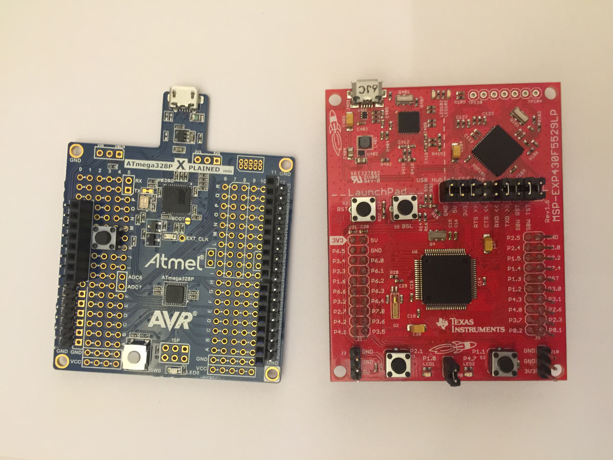

# SEP_2018-2

Esta repo almacena los codigos utilizados en las experiencias de laboratorio de
Sistemas Electronicos programables, en los cuales se obtuvo el siguiente desempeño:
* Lab1: Distinguido
* Lab2: Distinguido
* Lab3: Distinguido
* Lab4: Distinguido
* Lab5: Distinguido
* Lab6: Distinguido
* Lab7: Distinguido
* Lab8: Distinguido
* Lab9: Distinguido
* Lab10: Distinguido
* Lab11: Distinguido
* Lab12: Distinguido
* Lab13: Distinguido

## Tarjetas utilizadas

  

